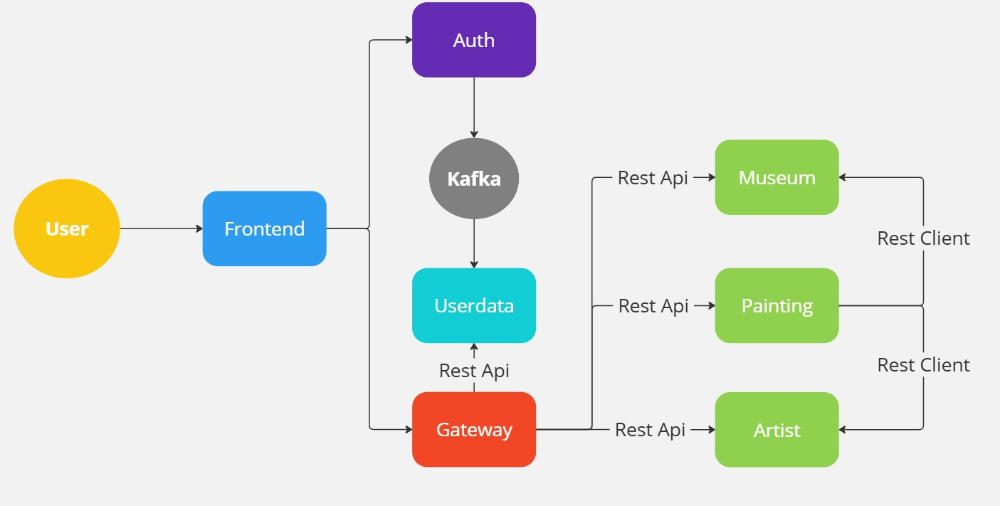
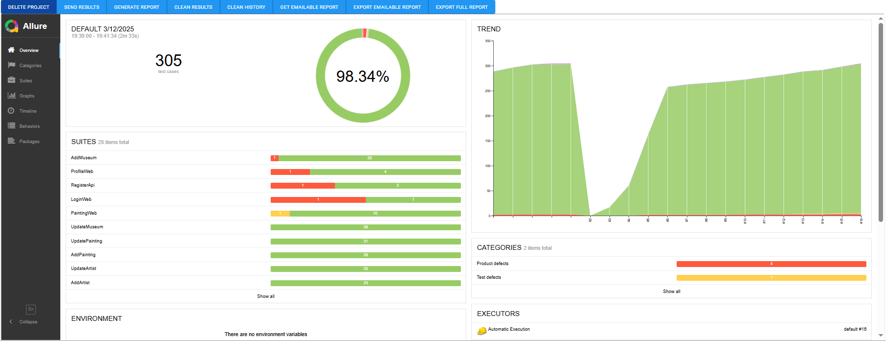
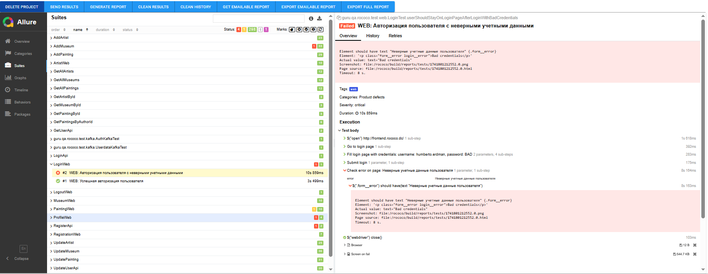

# Rococo


**Rococo — ваш личный гид в мире живописи! Погрузитесь в удивительный мир искусства, изучая шедевры великих мастеров, раскрывая тайны их создания и знакомясь с биографиями художников. Исследуйте коллекции известных музеев со всего мира, открывайте новые произведения и обогащайте свои знания о культуре и истории живописи. Rococo поможет вам окунуться в атмосферу искусства, где каждая картина — это история, а каждый музей — целый мир вдохновения.**

## Содержание

- [Технологический стек](#технологический-стек)
- [Архитектурное устройство приложения](#архитектурное-устройство-приложения)
- [Сетевые порты и их назначение](#сетевые-порты-и-их-назначение)
- [Минимальные предусловия для работы с проектом Rococo](#минимальные-предусловия-для-работы-с-проектом-rococo)
- [Локальный запуск Rococo в среде разработки](#локальный-запуск-rococo-в-среде-разработки)
- [Развёртывание Rococo в Docker](#развёртывание-rococo-в-docker)
- [Запуск тестов в локальном окружении](#запуск-тестов-в-локальном-окружении)
- [Запуск тестов в Docker](#запуск-тестов-в-docker)
- [Образец отчёта о тестировании](#образец-отчёта-о-тестировании)

## Технологический стек

- [Spring Authorization Server](https://spring.io/projects/spring-authorization-server)
- [Spring OAuth 2.0 Resource Server](https://docs.spring.io/spring-security/reference/servlet/oauth2/resource-server/index.html)
- [Spring data JPA](https://spring.io/projects/spring-data-jpa)
- [Spring Web](https://docs.spring.io/spring-framework/docs/current/reference/html/web.html#spring-web)
- [Spring actuator](https://docs.spring.io/spring-boot/docs/current/reference/html/actuator.html)
- [Spring web-services](https://docs.spring.io/spring-ws/docs/current/reference/html/)
- [Apache Kafka](https://developer.confluent.io/quickstart/kafka-docker/)
- [Docker](https://www.docker.com/resources/what-container/)
- [Docker-compose](https://docs.docker.com/compose/)
- [Postgres](https://www.postgresql.org/about/)
- [React](https://ru.reactjs.org/docs/getting-started.html)
- [Thymeleaf](https://www.thymeleaf.org/)
- [Jakarta Bean Validation](https://beanvalidation.org/)
- [Jakarta JAXB](https://eclipse-ee4j.github.io/jaxb-ri/)
- [JUnit 5 (Extensions, Resolvers, etc)](https://junit.org/junit5/docs/current/user-guide/)
- [Retrofit 2](https://square.github.io/retrofit/)
- [Allure](https://docs.qameta.io/allure/)
- [Selenide](https://selenide.org/)
- [Selenoid & Selenoid-UI](https://aerokube.com/selenoid/latest/)
- [Allure-docker-service](https://github.com/fescobar/allure-docker-service)
- [Java 21](https://adoptium.net/en-GB/temurin/releases/)
- [Gradle 8.6](https://docs.gradle.org/8.6/release-notes.html)
- [GHA](https://docs.github.com/en/actions)
- И многие другие


<a name="architecture"></a>
## Архитектурное устройство приложения

Приложение Rococo построено на основе микросервисной архитектуры:

- **auth** - управление процессами аутентификации и авторизации.
- **gateway** - централизованная обработка клиентских запросов и маршрутизация к нужным микросервисам.
- **userdata** - хранение информации о пользователе, включая юзернейм, имя, фамилию и аватар.
- **museum** - информация о музеях.
- **artist** - информация о художниках.
- **painting** - информация о картинах.
- frontend - пользовательский интерфейс приложения.

Пользователь взаимодействует с системой исключительно через auth и gateway, используя REST API, не имея прямого доступа к другим микросервисам.
Все клиентские запросы проходят через gateway, который маршрутизирует их к соответствующим сервисам.

Исключением является painting-сервис, который напрямую взаимодействует с artist-сервисом и museum-сервисом через REST Client.
Gateway выполняет роль единой точки входа в систему, а auth-сервис отвечает за аутентификацию и передачу информации о пользователях в userdata-сервис.



<a name="ports"></a>
## Сетевые порты и их назначение

|  Сервис  |     Порт      |
|:--------:|:-------------:|
|   AUTH   | 9000 (server) |
| GATEWAY  | 8090 (server) |
|  ARTIST  |  8282 (rest)  |
|  MUSEUM  |  8283 (rest)  |
| PAINTING |  8284 (rest)  |
| USERDATA |  8285 (rest)  |
| FRONTEND |  80 (server)  |

<a name="minimum-system-requirements"></a>
## Минимальные предусловия для работы с проектом Rococo
#### 0. Если у вас ОС Windows

Во-первых, и в-главных, необходимо использовать [bash terminal](https://www.geeksforgeeks.org/working-on-git-bash/), а
не powershell.
[Полезное и короткое видео о git bash](https://www.youtube.com/watch?v=zM9Mb-otqww)

#### 1. Установить docker (Если не установлен)

Мы будем использовать docker для БД (Postgres), кроме того, будем запускать микросервисы в едином docker network при
помощи docker-compose

[Установка на Windows](https://docs.docker.com/desktop/install/windows-install/)

[Установка на Mac](https://docs.docker.com/desktop/install/mac-install/) (Для ARM и Intel разные пакеты)

[Установка на Linux](https://docs.docker.com/desktop/install/linux-install/)

После установки и запуска docker daemon необходимо убедиться в работе команд docker, например `docker -v`:

```posh
User-MacBook-Pro ~ % docker -v
Docker version 20.10.14, build a224086
```

#### 2. Спуллить контейнер postgres:15.1, zookeeper и kafka версии 7.3.2

```posh
docker pull postgres:15.1
docker pull confluentinc/cp-zookeeper:7.3.2
docker pull confluentinc/cp-kafka:7.3.2
```

После `pull` вы увидите спуленный image командой `docker images`

```posh
mitriis-MacBook-Pro ~ % docker images            
REPOSITORY                 TAG              IMAGE ID       CREATED         SIZE
postgres                   15.1             9f3ec01f884d   10 days ago     379MB
confluentinc/cp-kafka      7.3.2            db97697f6e28   12 months ago   457MB
confluentinc/cp-zookeeper  7.3.2            6fe5551964f5   7 years ago     451MB

```

#### 3. Создать volume для сохранения данных из БД в docker на вашем компьютере

```posh
docker volume create pgdata
```

#### 4. Запустить БД, zookeeper и kafka 3-мя последовательными командами:

Запустив скрипт (Для Windows необходимо использовать bash terminal: gitbash, cygwin или wsl)

```posh
User-MacBook-Pro  rococo % bash localenv.sh
```

Или выполнив последовательно команды, для *nix:

```posh
docker run --name rococo-all -p 5432:5432 -e POSTGRES_PASSWORD=secret -e CREATE_DATABASES=rococo-auth,rococo-currency,rococo-spend,rococo-userdata -v pgdata:/var/lib/postgresql/data -v ./postgres/init-database.sh:/docker-entrypoint-initdb.d/init-database.sh -d postgres:15.1 --max_prepared_transactions=100

docker run --name=zookeeper -e ZOOKEEPER_CLIENT_PORT=2181 -p 2181:2181 -d confluentinc/cp-zookeeper:7.3.2

docker run --name=kafka -e KAFKA_BROKER_ID=1 \
-e KAFKA_ZOOKEEPER_CONNECT=$(docker inspect zookeeper --format='{{ .NetworkSettings.IPAddress }}'):2181 \
-e KAFKA_ADVERTISED_LISTENERS=PLAINTEXT://localhost:9092 \
-e KAFKA_OFFSETS_TOPIC_REPLICATION_FACTOR=1 \
-e KAFKA_TRANSACTION_STATE_LOG_MIN_ISR=1 \
-e KAFKA_TRANSACTION_STATE_LOG_REPLICATION_FACTOR=1 \
-p 9092:9092 -d confluentinc/cp-kafka:7.3.2
```

Для Windows (Необходимо использовать bash terminal: gitbash, cygwin или wsl):

```posh
docker run --name rococo-all -p 5432:5432 -e POSTGRES_PASSWORD=secret -e CREATE_DATABASES=rococo-auth,rococo-currency,rococo-spend,rococo-userdata -v pgdata:/var/lib/postgresql/data -v ./postgres/init-database.sh:/docker-entrypoint-initdb.d/init-database.sh -d postgres:15.1 --max_prepared_transactions=100

docker run --name=zookeeper -e ZOOKEEPER_CLIENT_PORT=2181 -p 2181:2181 -d confluentinc/cp-zookeeper:7.3.2

docker run --name=kafka -e KAFKA_BROKER_ID=1 -e KAFKA_ZOOKEEPER_CONNECT=$(docker inspect zookeeper --format="{{ .NetworkSettings.IPAddress }}"):2181 -e KAFKA_ADVERTISED_LISTENERS=PLAINTEXT://localhost:9092 -e KAFKA_OFFSETS_TOPIC_REPLICATION_FACTOR=1 -e KAFKA_TRANSACTION_STATE_LOG_MIN_ISR=1 -e KAFKA_TRANSACTION_STATE_LOG_REPLICATION_FACTOR=1 -p 9092:9092 -d confluentinc/cp-kafka:7.3.2
```

[Про IP zookeeper](https://github.com/confluentinc/cp-docker-images/issues/801#issuecomment-692085103)

Если вы используете Windows и контейнер с БД не стартует с ошибкой в логе:

```
server started
/usr/local/bin/docker-entrypoint.sh: running /docker-entrypoint-initdb.d/init-database.sh
/usr/local/bin/docker-entrypoint.sh: /docker-entrypoint-initdb.d/init-database.sh: /bin/bash^M: bad interpreter: No such file or directory
```

То необходимо выполнить следующие команды в каталоге /postgres :

```
sed -i -e 's/\r$//' init-database.sh
chmod +x init-database.sh
```

#### 5. Установить Java версии 21. Это необходимо, т.к. проект использует синтаксис Java 21

Версию установленной Java необходимо проверить командой `java -version`

```posh
User-MacBook-Pro ~ % java -version
openjdk version "21.0.1" 2023-10-17 LTS
OpenJDK Runtime Environment Temurin-21.0.1+12 (build 21.0.1+12-LTS)
OpenJDK 64-Bit Server VM Temurin-21.0.1+12 (build 21.0.1+12-LTS, mixed mode)
```

Если у вас несколько версий Java одновременно - то хотя бы одна из них должна быть 21
Если java не установлена вовсе, то рекомендую установить OpenJDK (например,
из https://adoptium.net/en-GB/temurin/releases/)

#### 6. Установить пакетный менеджер для сборки front-end npm

[Инструкция](https://docs.npmjs.com/downloading-and-installing-node-js-and-npm).
Рекомендованная версия Node.js - 22.6.0

<a name="local-run"></a>
## Локальный запуск Rococo в среде разработки

#### 1. Перейти в каталог с фронтендом:

```posh
User-MacBook-Pro rococo % cd rococo-client
```

#### 2. Запустить фронтенд в режиме preview (сначала обновить зависимости)

```posh
User-MacBook-Pro rococo-client % npm i
User-MacBook-Pro rococo-client % npm run dev
```

#### 3. Прописать run конфигурацию для всех сервисов rococo-* - Active profiles local

Для этого зайти в меню Run -> Edit Configurations -> выбрать main класс -> указать Active profiles: local
[Инструкция](https://stackoverflow.com/questions/39738901/how-do-i-activate-a-spring-boot-profile-when-running-from-intellij).

#### 4 Запустить сервис Rococo-auth c помощью gradle или командой Run в IDE:

- Запустить сервис auth

```posh
User-MacBook-Pro rococo % cd rococo-auth
User-MacBook-Pro rococo-auth % gradle bootRun --args='--spring.profiles.active=local'
```

Или просто перейдя к main-классу приложения RococoAuthApplication выбрать run в IDEA (предварительно удостовериться что
выполнен предыдущий пункт)

#### 5  Запустить в любой последовательности другие сервисы: rococo-artist, rococo-museum, rococo-painting, rococo-gateway, rococo-userdata

Фронтенд Rococo при запуске локально будет работать для вас по адресу http://127.0.0.1:3000/

<a name="docker-run"></a>
## Развёртывание Rococo в Docker

#### 1. Создать бесплатную учетную запись на https://hub.docker.com/ (если отсутствует)

#### 2. Создать в настройках своей учетной записи access_token [Инструкция](https://docs.docker.com/docker-hub/access-tokens/).

#### 3. Выполнить docker login с созданным access_token (в инструкции это описано)

<a name="hosts"></a>
#### 4. Прописать в etc/hosts элиас для Docker-имени

#### frontend:  127.0.0.1 frontend.rococo.dc,
#### auth:      127.0.0.1 auth.rococo.dc
#### gateway:   127.0.0.1 gateway.rococo.dc

Для *nix:
```posh
$ vi /etc/hosts
```
```posh
##
# Host Database
#
# localhost is used to configure the loopback interface
# when the system is booting.  Do not change this entry.
##
127.0.0.1       localhost
127.0.0.1       frontend.rococo.dc
127.0.0.1       auth.rococo.dc
127.0.0.1       gateway.rococo.dc
```

В windows файл hosts лежит по пути:
```
C:\Windows\System32\drivers\etc\hosts
```

#### 5. Перейти в корневой каталог проекта

```posh
$ cd rococo
```

#### 6. Запустить все сервисы

```posh
$ bash docker-compose-dev.sh
```

Текущая версия docker-compose-dev.sh удалит все старые Docker контейнеры в системе, поэтому если у Вас есть созданные
контейнеры для других проектов - отредактируйте строку ```posh docker rm $(docker ps -a -q)```, чтобы включить в grep
только те контейнеры, которые относятся к rococo.

Rococo при запуске в докере будет работать для Вас по адресу http://frontend.rococo.dc:80, этот порт не нужно
указывать в браузере, таким образом переходить напрямую по ссылке http://frontend.rococo.dc

<a name="local-run-tests"></a>
## Запуск тестов в локальном окружении

**Обратите внимание! Запуск тестов происходит в четыре потока. Изменить число потоков можно в
файле [junit-platform.properties](rococo-tests%2Fsrc%2Ftest%2Fresources%2Fjunit-platform.properties)**

1. Запустить приложение локально и запустить тесты из корня проекта
```posh
$ ./gradlew :rococo-tests:clean test
```

2. После прогона тестов запустить формирование отчёта командой:
```posh
$ ./gradlew :rococo-tests:allureServe
```

3. Примечание
Вы можете запустить тесты по определённому тегу с помощью предопределённых задач
```posh
// Универсальная задача для запуска тестов с тегами
def createTagTask(String name, String tag) {
    tasks.register(name, Test) {
        useJUnitPlatform {
            includeTags(tag)
        }
        testLogging {
            events "passed", "skipped", "failed", "standardOut", "standardError"
            exceptionFormat "short"
        }
    }
}

// Задачи для запуска тестов по тегам
createTagTask('testApi', 'api')
createTagTask('testWeb', 'web')
```
Запуск API-тестов:
```posh
./gradlew :rococo-tests:testApi
```
Запуск Web-тестов:
```posh
./gradlew :rococo-tests:testWeb
```

<a name="docker-run-tests"></a>
## Запуск тестов в Docker
1. Добавить в файл hosts строку (как работать с файлом hosts описано в пункте [Прописать в etc/hosts элиас для Docker-имени](#hosts)):

<b>127.0.0.1 allure</b>

Итоговый файл hosts должен выглядеть следующим образом:

```posh
##
# Host Database
#
# localhost is used to configure the loopback interface
# when the system is booting.  Do not change this entry.
##
127.0.0.1       localhost
127.0.0.1       frontend.rococo.dc
127.0.0.1       auth.rococo.dc
127.0.0.1       gateway.rococo.dc
127.0.0.1       allure
```

2. Запустить скрипт:
```posh
$ bash docker-compose-test.sh
```
3. Дополнительные варианты запуска

Можно выбрать браузер, передав его название (chrome или firefox) в параметрах команды:
```posh
bash docker-compose-test.sh chrome
bash docker-compose-test.sh firefox
```
По умолчанию, если не передавать в команде название браузера, используется Chrome.

Чтобы избежать пересборку и только перезапустить тестовый контейнер:
```posh
bash docker-compose-test.sh --skip-build
```
Также можно использовать одновременно выбор браузера и пропуск сборки:
```posh
bash docker-compose-test.sh chrome --skip-build
bash docker-compose-test.sh firefox --skip-build
```

4. После того, как все контейнеры успешно соберутся и запустятся - переключиться на логи контейнера rococo-tests командой:
```posh
$ docker logs -f rococo-tests
```
5. После прогона тестов в логах отобразится ссылка на аллюр отчёт

<a name="report"></a>
### Итоговые dashboard в Allure Report

### Список тест-кейсов в Allure Report
